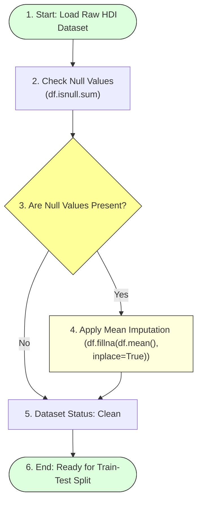

# Checking and Handling Null Values

## Project Title

**A Comprehensive Measure of Well-Being**

---

# Objective

The objective of this task is to identify missing values in the Human Development Index dataset and handle them appropriately before training the machine learning model.

---

# Introduction

Missing or null values are common in real-world datasets. They may occur due to incomplete data collection, manual entry errors, or unavailable records. If these missing values are not handled correctly, they can reduce model accuracy and produce unreliable predictions.

Therefore, checking and handling null values is an essential step in data preprocessing.

---

# Data Preprocessing: Null Values Imputation Flow



---

# Checking for Null Values

The dataset is inspected using the Pandas library to identify missing values in each column.

### Python Code:
```python
# Check total null counts per feature column
print("Missing values per column:")
print(df.isnull().sum())
```

This command returns the total number of missing values present in every column of the dataset.

---

# Handling Null Values

If null values are found, they must be replaced or removed before model training.

For numerical columns, the missing values are replaced using the **Mean** of the respective column.

### Python Code:
```python
# Replace all null values with feature column means
df.fillna(df.mean(), inplace=True)
```

The mean is chosen because it preserves the overall distribution of the numerical data without introducing significant bias or shifting the variance.

---

# Alternative Imputation Methods

Depending on the feature type, other commonly used techniques for handling missing values include:

* **Median Imputation:** Better for continuous variables containing significant outliers.
* **Mode Imputation:** Ideal for categorical features.
* **Row Deletion:** Dropping records if the missing percentage is very low (< 5%).
* **Column Deletion:** Removing features containing excessive null entries (> 40%).
* **KNN Imputation:** Fills nulls by calculating distances to the k-nearest similar samples.

For this project, mean value replacement is the most suitable approach because the dataset mainly contains continuous numerical features without extreme, irregular outliers.

---

# Importance of Handling Null Values

Handling missing values provides several benefits:
* **Improves model performance:** Ensures algorithms can map feature patterns continuously.
* **Prevents prediction errors:** Avoids NaN/Null calculations in linear equations.
* **Ensures data consistency:** Prepares uniform matrix inputs for the model fit.
* **Enhances data quality:** Builds a reliable pipeline for real-time predictions.
* **Produces more reliable machine learning models:** Mitigates training bias.

---

# Dataset Status

After checking the dataset:
* Missing values were identified using the `isnull()` function.
* Null values, if present, were replaced using the mean of each numerical column.
* The dataset became clean and ready for train-test splitting.

---

# Outcome

The Human Development Index dataset was successfully examined for missing values. Any null values were handled using mean value imputation, ensuring that the dataset is complete, consistent, and suitable for machine learning model training.
