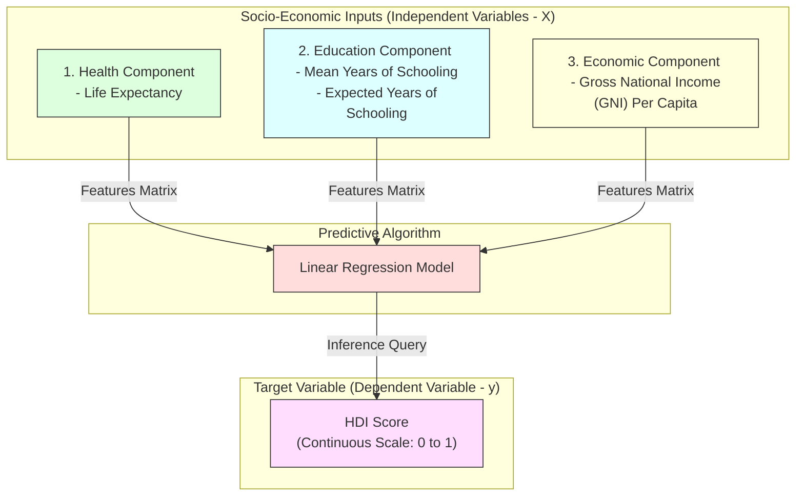

# Selecting Dependent and Independent Variables

## Project Title

**A Comprehensive Measure of Well-Being**

---

# Objective

The objective of this task is to identify the input (independent) variables and the output (dependent) variable from the Human Development Index (HDI) dataset. Proper feature selection is essential because it determines which data the machine learning model will use to make predictions.

---

# Introduction

Machine learning models require a clear distinction between the features (inputs) and the target (output). The independent variables contain the information used by the model to learn patterns, while the dependent variable is the value the model aims to predict.

For the HDI prediction project, multiple socio-economic indicators are used as inputs to estimate the Human Development Index score.

---

# Feature Selection and Model Target Layout



---

# Independent Variables (Features)

The following columns are selected as the independent variables because they significantly influence the Human Development Index.

* **Life Expectancy:** Measures the health status and longevity of a country's population.
* **Mean Years of Schooling:** Represents the average duration of education received by adults (25 years and older).
* **Expected Years of Schooling:** Estimates the total duration of education expected for a child entering school.
* **Gross National Income (GNI) Per Capita:** Measures the economic output and average standard of living.

These variables collectively represent the health, education, and economic status of a country.

### Python Code Example:
```python
# Extract feature matrix (X)
X = df[[
    'Life Expectancy',
    'Mean Years of Schooling',
    'Expected Years of Schooling',
    'GNI Per Capita'
]]
```

---

# Dependent Variable (Target)

The dependent variable is the value that the model predicts.

* **Target Variable:** `HDI Score` (A continuous index value ranging from 0 to 1).

### Python Code Example:
```python
# Extract target vector (y)
y = df['HDI']
```

---

# Why These Variables Were Selected

The selected features are the primary indicators used by the United Nations Development Programme (UNDP) to calculate the Human Development Index.

These indicators measure:
* **Health:** Represented by Life Expectancy.
* **Education:** Represented by Expected and Mean Years of Schooling.
* **Standard of Living:** Represented by GNI Per Capita.

Since they directly influence the HDI score, they are the most suitable features for prediction.

---

# Benefits of Feature Selection

* **Improves prediction accuracy:** Eliminates noise from non-essential variables.
* **Reduces unnecessary data:** Simplifies the dataset structure.
* **Simplifies model training:** Reduces mathematical dimensions.
* **Prevents overfitting:** Avoids memorization of unrelated columns.
* **Improves computational efficiency:** Speeds up execution.

---

# Outcome

The independent variables (Life Expectancy, Mean Years of Schooling, Expected Years of Schooling, and GNI Per Capita) and the dependent variable (HDI Score) were successfully identified. These variables will be used in the next stage for training the Linear Regression model.
