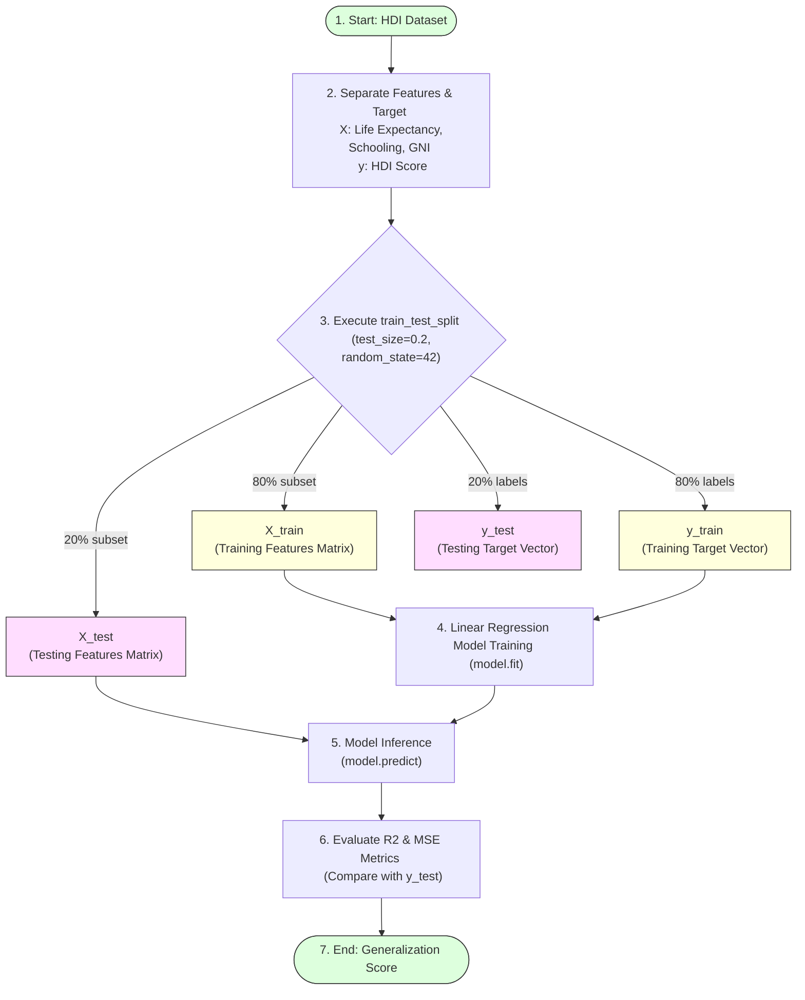

# Train and Test Data

## Project Title

**A Comprehensive Measure of Well-Being**

---

# Objective

The objective of this task is to divide the Human Development Index (HDI) dataset into training and testing datasets. Splitting the data enables the machine learning model to learn from one portion of the dataset while being evaluated on another, ensuring that the model performs well on unseen data.

---

# Introduction

In machine learning, evaluating a model using the same data on which it was trained can produce misleading results. To overcome this issue, the dataset is divided into two parts:

* **Training Dataset** – Used to train the machine learning model.
* **Testing Dataset** – Used to evaluate the model's prediction performance.

This process helps determine whether the model can generalize effectively to new and unseen data.

---

# Train-Test Split Partition Flow



---

# Why Train-Test Splitting is Important

The train-test split offers several benefits:

* Prevents overfitting.
* Measures model performance on unseen data.
* Improves model reliability.
* Helps evaluate prediction accuracy.
* Supports fair comparison between different machine learning models.

---

# Train-Test Split

The dataset is divided using the `train_test_split()` function available in the Scikit-learn library.

### Python Code

```python
from sklearn.model_selection import train_test_split

X_train, X_test, y_train, y_test = train_test_split(
    X,
    y,
    test_size=0.2,
    random_state=42
)
```

---

# Parameter Description

| Parameter       | Description                              |
| --------------- | ---------------------------------------- |
| **X**           | Independent variables (features matrix)  |
| **y**           | Dependent variable (target vector)       |
| **test_size=0.2**| Allocates 20% of the dataset for testing |
| **random_state=42**| Ensures reproducible results          |

---

# Dataset Distribution

| Dataset       | Percentage |
| ------------- | ---------- |
| **Training Data** | 80%        |
| **Testing Data**  | 20%        |

The training dataset is used to build the Linear Regression model, while the testing dataset is reserved for evaluating its performance.

---

# Advantages

* Enables unbiased model evaluation.
* Prevents data leakage.
* Improves model generalization.
* Supports accurate performance measurement.
* Provides consistent and reproducible results.

---

# Outcome

The Human Development Index dataset was successfully divided into training and testing datasets using Scikit-learn's `train_test_split()` function. Approximately 80% of the data was allocated for training and 20% for testing. The dataset is now ready for model training in the next phase.
