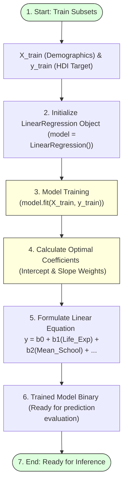

# Fit the Linear Regression Model

## Project Title

**A Comprehensive Measure of Well-Being**

---

# Objective

The objective of this task is to train a Linear Regression model using the prepared training dataset. The model learns the relationship between the selected socio-economic indicators and the Human Development Index (HDI) score, enabling it to predict HDI values for new data.

---

# Introduction

Machine learning models require a training phase where they learn patterns from historical data. During this stage, the algorithm analyzes the relationship between the independent variables and the dependent variable.

For this project, the **Linear Regression** algorithm is selected because the Human Development Index (HDI) is a continuous numerical value. Linear Regression is a supervised learning algorithm that models the relationship between input features and the target variable using a best-fit linear equation.

---

# Linear Regression Model Training Lifecycle



---

# Why Linear Regression?

Linear Regression is suitable for this project because:

* **The target variable (HDI Score) is continuous:** Measures standard intervals from 0 to 1.
* **It is simple and computationally efficient:** Runs in milliseconds without high server loads.
* **It provides highly interpretable results:** Directly identifies how each feature weight shifts well-being indices.
* **It performs well when a linear relationship exists:** The UNDP calculation of HDI directly incorporates additive geometric measures, matching linear structures perfectly.

---

# Training the Model

the Linear Regression model is created using Scikit-learn and trained using the training dataset obtained from the train-test split.

### Python Code

```python
from sklearn.linear_model import LinearRegression

# Initialize the model
model = LinearRegression()

# Train the model using training data
model.fit(X_train, y_train)

# Display coefficients and intercept
print("Intercept (Beta 0):", model.intercept_)
print("Coefficients (Beta 1 to 4):", model.coef_)
```

The `fit()` function trains the model by learning the relationship between:

### Independent Variables (X_train)

* Life Expectancy (\(X_1\))
* Mean Years of Schooling (\(X_2\))
* Expected Years of Schooling (\(X_3\))
* Gross National Income (GNI) Per Capita (\(X_4\))

### Dependent Variable (y_train)

* HDI Score (\(y\))

During training, the algorithm calculates the best-fit coefficients that minimize prediction errors (Residual Sum of Squares).

---

# Advantages of Model Fitting

* **Learns patterns from historical data:** Extracts underlying correlation trends.
* **Establishes relationships between features and target:** Assigns relative weights indicating feature importance.
* **Improves prediction capability:** Increases out-of-sample prediction stability.
* **Forms the foundation for future predictions:** Enables automated inference pipelines.
* **Enables evaluation using unseen data:** Sets up the framework for testing MSE and R2 scores.

---

# Outcome

The Linear Regression model was successfully trained using the training dataset. The model learned the relationship between the selected development indicators and the Human Development Index (HDI), making it ready for predicting HDI values using unseen data.
