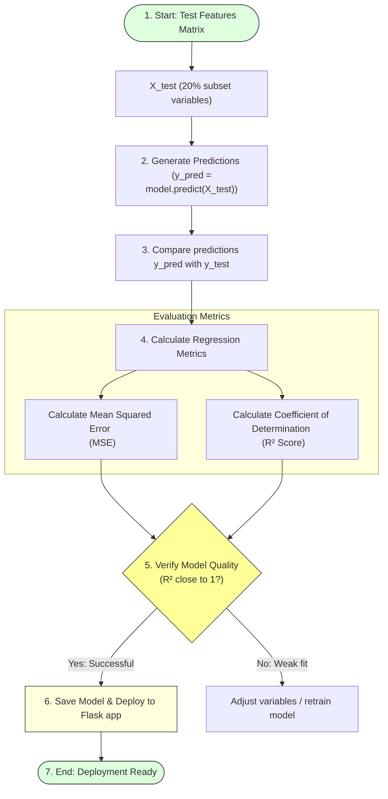

# Predicting the Results

## Project Title

**A Comprehensive Measure of Well-Being**

---

# Objective

The objective of this task is to use the trained Linear Regression model to predict Human Development Index (HDI) scores for the testing dataset and evaluate the model's prediction performance.

---

# Introduction

Once the machine learning model has been trained, it is tested using unseen data. Prediction is the process of applying the trained model to the testing dataset to estimate the target values.

This step verifies whether the model has learned meaningful relationships from the training data and can accurately predict HDI scores for new observations.

---

# Model Inference & Metrics Benchmarking Flow



---

# Predicting HDI Scores

The trained model generates predictions using the testing dataset.

### Python Code

```python
# Generate predictions for the test dataset
y_pred = model.predict(X_test)
```

The `predict()` function estimates the Human Development Index (HDI) score for each record in the testing dataset based on the learned relationships.

---

# Model Evaluation

The predicted values are compared with the actual HDI scores using regression evaluation metrics.

### Python Code

```python
from sklearn.metrics import mean_squared_error, r2_score

# Calculate Mean Squared Error (MSE)
mse = mean_squared_error(y_test, y_pred)

# Calculate R-squared (R²) score
r2 = r2_score(y_test, y_pred)

print(f"Mean Squared Error (MSE): {mse:.6f}")
print(f"R² Score (Coefficient of Determination): {r2:.4f}")
```

---

# Evaluation Metrics Detail

### Mean Squared Error (MSE)

Measures the average squared difference between actual and predicted values:
\[\text{MSE} = \frac{1}{n} \sum_{i=1}^{n} (y_i - \hat{y}_i)^2\]
* A lower MSE indicates better prediction performance (closer to 0 is ideal).

### R² Score (Coefficient of Determination)

Measures how well the model explains the variation in the target variable:
\[R^2 = 1 - \frac{\text{Sum of Squared Residuals (SSR)}}{\text{Total Sum of Squares (SST)}}\]
* **R² = 1** indicates perfect prediction.
* **R² close to 1** indicates excellent model performance.
* **R² close to 0** indicates poor prediction capability.

---

# Importance of Prediction

* **Tests the model using unseen data:** Ensures generalization stability.
* **Measures prediction accuracy:** Quantifies standard deviation from reality.
* **Validates model performance:** Verifies linear assumptions hold true.
* **Helps identify areas for improvement:** Highlights high residual outliers.
* **Ensures the model can generalize to real-world data:** Prerequisites web API deployment.

---

# Outcome

The trained Linear Regression model successfully predicted Human Development Index (HDI) scores for the testing dataset. The prediction results were evaluated using regression metrics such as Mean Squared Error (MSE) and R² Score, confirming the model's effectiveness and readiness for deployment in the Flask web application.
