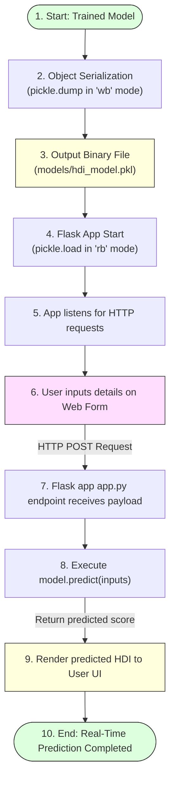

# Saving the Model

## Project Title

**A Comprehensive Measure of Well-Being**

---

# Objective

The objective of this task is to save the trained Linear Regression model into a serialized file so that it can be reused for future predictions without retraining. The saved model will later be integrated into the Flask web application to provide real-time Human Development Index (HDI) predictions.

---

# Introduction

After successfully training and evaluating a machine learning model, it is important to preserve the trained model for future use. Retraining the model every time the application runs is inefficient and increases computational time.

To solve this problem, the trained model is serialized and stored as a **Pickle (.pkl)** file. The saved model can be loaded whenever required, allowing the application to generate predictions instantly without repeating the training process.

---

# Model Serialization & Deployment Flow



---

# What is Pickle?

**Pickle** is a built-in Python module used for object serialization and deserialization.

* **Serialization** (pickling) is the process of converting a Python object into a byte stream that can be stored in a file.
* **Deserialization** (unpickling) is the process of converting the stored byte stream back into the original Python object.

Since machine learning models are complex Python objects, Pickle provides an efficient way to save and reload them.

---

# Saving the Trained Model

The trained Linear Regression model is saved using the `pickle` module.

### Python Code

```python
import pickle
import os

# Ensure the 'models' directory exists
os.makedirs('models', exist_ok=True)

# Save the trained model to disk
with open('models/hdi_model.pkl', 'wb') as file:
    pickle.dump(model, file)

print("Linear Regression model serialized and saved successfully.")
```

The above code stores the trained model in the **models** folder as `hdi_model.pkl`.

---

# Loading the Saved Model

Whenever predictions are required, the saved model can be loaded without retraining.

### Python Code

```python
import pickle

# Load the saved model from disk
with open('models/hdi_model.pkl', 'rb') as file:
    loaded_model = pickle.load(file)

# The loaded model behaves exactly like the original trained model
print("Model loaded successfully.")
```

The loaded model behaves exactly like the original trained model.

---

# Advantages of Saving the Model

* **Eliminates the need for retraining:** Avoids computing weight coefficients at every application startup.
* **Reduces execution time:** Restores model status instantly.
* **Saves computational resources:** Highly efficient for resource-constrained environments.
* **Ensures consistent prediction results:** Restores the exact mathematical model state.
* **Simplifies deployment in web applications:** Integrates seamlessly with production microservices.
* **Enables reuse across multiple applications:** The same binary can be called by APIs, scripts, or worker tasks.

---

# Application in Flask

The saved model is loaded when the Flask application starts. User-provided values such as Life Expectancy, Mean Years of Schooling, Expected Years of Schooling, and GNI Per Capita are passed to the model, which returns the predicted HDI score.

This enables real-time prediction through a web interface.

---

# Outcome

The trained Linear Regression model was successfully serialized and saved as a `.pkl` file using the Pickle module. The saved model is portable, reusable, and ready for integration into the Flask web application, enabling efficient and consistent HDI predictions without retraining.
